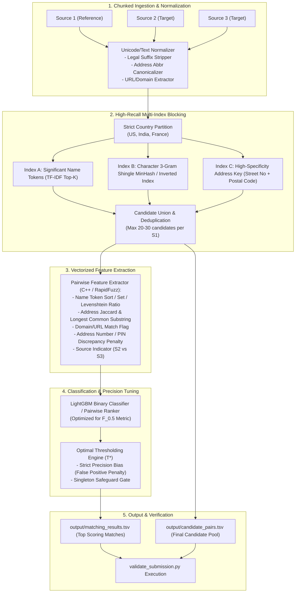

# Comprehensive Technical Implementation Plan
## Scalable Multi-Source Business Entity Resolution (ER-3S)

---

### 1. Architectural Overview



---

### 2. Phase-by-Phase Roadmap

#### Phase 1: Environment Setup & Core Dependencies
- **Objective:** Provision high-performance C-optimized libraries for fast text processing on Windows AMD CPU.
- **Key Packages:**
  - `polars` / `pandas`: Memory-efficient columnar operations and streaming TSV parsing.
  - `rapidfuzz`: High-speed C++ Levenshtein, Jaro-Winkler, and token similarity algorithms.
  - `lightgbm`: Ultra-fast GBDT classifier with low memory footprint and high parallel CPU efficiency.
  - `scikit-learn`: TF-IDF vectorization, evaluation metrics, and cross-validation splitting.
  - `numpy`, `scipy`: Sparse matrix operations for candidate pairing.
- **Deliverables:**
  - `code/business_entity_resolution/requirements.txt`
  - Validation test confirming all native extensions execute correctly.

---

#### Phase 2: Domain-Aware Normalization Engine
- **Objective:** Eliminate surface variance across noisy text fields while preserving differentiating discriminators.
- **Tasks:**
  1. **Unicode & Diacritics Normalization:**
     - NFKD Unicode normalization to handle French accents (`é` $\to$ `e`, `ô` $\to$ `o`, `ç` $\to$ `c`).
     - Case folding, strip punctuation, remove non-printable control characters.
  2. **Legal Suffix Canonicalization:**
     - Strip or standardize business forms:
       - US: `inc`, `incorporated`, `corp`, `corporation`, `llc`, `ltd`, `limited`, `co`, `company`.
       - India: `pvt ltd`, `private limited`, `llp`, `enterprises`, `industries`, `traders`.
       - France: `sarl`, `sas`, `sa`, `eurl`, `snc`, `ste`.
  3. **Address Component Harmonization:**
     - Street types: `rd` $\to$ `road`, `st` $\to$ `street`, `ave` $\to$ `avenue`, `blvd` $\to$ `boulevard`, `fl` $\to$ `floor`, `bldg` $\to$ `building`.
     - State abbreviations: `ny` $\to$ `new york`, `ca` $\to$ `california`, `tx` $\to$ `texas`.
  4. **Domain / URL Entity Handling:**
     - Detect URL patterns in `business_name` (e.g. `maurewilliamscolombier.com`).
     - Strip domain suffixes (`.com`, `.in`, `.org`, `.net`) and clean subdomains (`www.`) to extract root brand names.
  5. **Missing Value Imputation:**
     - Treat missing address as special token `[MISSING_ADDR]` and create binary indicator `has_missing_addr`.

---

#### Phase 3: High-Recall, Sub-Linear Candidate Generation (Blocking)
- **Objective:** Reduce search space from 17.2 trillion pairs to $\le 35$ million pairs ($\le 20$ candidates per $S_1$) with $\ge 92\%$ recall.
- **Blocking Scheme:**
  1. **Partition by Country:**
     - Hard constraint: $S_1(\text{country}) \equiv S_{2/3}(\text{country})$. Zero cross-country comparisons.
     - Partitions: US, India, France.
  2. **Multi-Pass Union Blocking Strategy:**
     - **Pass A (Significant Token Inverted Index):**
       - Build inverted index on high-IDF name tokens (excluding stopwords and frequent legal terms).
       - Query candidate entities sharing at least 1 rare token or 2 common tokens.
     - **Pass B (Character 3-Gram Shingle Index / MinHash):**
       - Catch typographic errors (`Maure Wilblims` vs `Maure Williams`) via character n-gram inverted indexing.
     - **Pass C (Strict Address Matching Key):**
       - Extract numbers (postal code / building number) + first 4 letters of street name.
       - Captures entities with disparate trade names (DBA) sharing identical physical locations.
  3. **Candidate Pruning & Capping:**
     - For each $S_1$ entity, rank pooled candidates by cheap token overlap score and retain top $K \le 25$ candidates.
     - Output written directly to `candidate_pairs.tsv` to ensure compliance.

---

#### Phase 4: Vectorized Feature Engineering
- **Objective:** Compute highly discriminative similarity signals for every candidate pair $(S_1, S_k)$ in $\le 5$ microseconds per pair.
- **Feature Set:**
  1. **Name Similarity Features:**
     - `name_levenshtein_ratio`: Character-level edit distance ratio.
     - `name_token_sort_ratio`: Order-independent word match ratio.
     - `name_token_set_ratio`: Substring/subset word match ratio (handles prefix/suffix additions).
     - `name_prefix_match`: Match length of common prefix.
     - `name_domain_similarity`: Similarity between $S_1$ name and $S_k$ extracted domain.
  2. **Address Similarity Features:**
     - `addr_token_jaccard`: Word-level Jaccard overlap on address tokens.
     - `addr_levenshtein_ratio`: Character edit distance on normalized addresses.
     - `addr_number_match`: Exact match indicator for street numbers and postal codes (0 = mismatch, 1 = match, -1 = missing).
     - `addr_missing_flag`: Indicates whether either record had a null address.
  3. **Cross-Field Interaction Features:**
     - `high_name_no_addr`: High name similarity with missing address.
     - `high_addr_low_name`: Identical address with different business name (DBA signal).
     - `source_origin`: Indicator whether target is from Source 2 or Source 3.

---

#### Phase 5: Matching Model & $F_{0.5}$ Optimization
- **Objective:** Train gradient-boosted decision tree (LightGBM) to score candidate pairs and determine precision-optimal decision thresholds.
- **Methodology:**
  1. **Validation Split Design:**
     - Hold out a clean 10% stratified sample of $S_1$ entities from training set (~220,000 entities) along with all their ground truth matches.
     - Zero leakage: Validation $S_1$ entities and their targets are excluded from training candidate generation.
  2. **Model Training:**
     - Train LightGBM Binary Classifier on candidate pairs generated from the 90% training split.
     - Objective: `binary:logloss` with focal weight on hard negatives.
     - Hyperparameters: `num_leaves=63`, `max_depth=7`, `learning_rate=0.05`, `n_estimators=600`.
  3. **Decision Threshold Optimization ($T^*$):**
     - Sweep threshold $T \in [0.40, 0.95]$ on validation holdout.
     - Compute macro $F_{0.5}$ across all validation $S_1$ entities (including singletons).
     - Select $T^*$ that maximizes global macro $F_{0.5}$.

---

#### Phase 6: Post-Processing, Sub-Graph Consistency & Format Enforcement
- **Objective:** Enforce zero formatting errors and produce verified submission artifacts.
- **Pipeline Logic:**
  1. Generate `output/candidate_pairs.tsv` containing all candidates evaluated by the model.
  2. Filter pairs with model prediction probability $\ge T^*$.
  3. Aggregate matched IDs per $S_1$ entity as comma-separated string (empty string for singletons).
  4. Ensure every single test $S_1$ entity exists in `output/matching_results.tsv`.
  5. Validate that matched IDs $\subseteq$ candidate IDs.
  6. Execute `utils/validate_submission.py` in strict mode (`PASS` required).

---

#### Phase 7: Packaging, Documentation & Git Integration
- **Objective:** Package the complete, reproducible submission archive adhering to all competition rules.
- **Structure:**
  ```text
  Aditaya_submission.zip
  ├── output/
  │   ├── matching_results.tsv
  │   └── candidate_pairs.tsv
  ├── code/
  │   └── business_entity_resolution/
  │       ├── src/
  │       │   ├── __init__.py
  │       │   ├── preprocess.py
  │       │   ├── blocking.py
  │       │   ├── features.py
  │       │   ├── model.py
  │       │   └── pipeline.py
  │       ├── README.md
  │       └── requirements.txt
  └── Documentation_template.md
  ```
- **Git Repo Sync:** Initialize git, link to `https://github.com/Aditaya-jpg/Amazon-ML-Challenge.git`, commit PRD, plan, and initial pipeline codebase.

---

### 3. Risk Assessment & Mitigations

| Risk | Impact | Likelihood | Mitigation Strategy |
| :--- | :--- | :--- | :--- |
| **Out-Of-Memory (OOM) on 16GB RAM** | High | High | Implement streaming batch processing (100k entities per chunk); avoid storing cross-product matrices in memory. |
| **Unseen Country (France) Failure** | High | Medium | Language-agnostic Unicode normalization (NFKD) and country-partitioned blocking ensure French records are processed seamlessly. |
| **Precision Degradation on Singletons** | High | High | Calibrate threshold $T^*$ specifically with the 5.6% singleton penalty in mind; set high bar for acceptance. |
| **Missing Address False Negatives** | Medium | Medium | Dual-path matching logic: when address is NaN, rely on strict name token sort ratio $\ge 0.85$. |
| **Submission Format Rejection** | Fatal | Low | Continuous verification using competition's own `validate_submission.py` on every run. |
